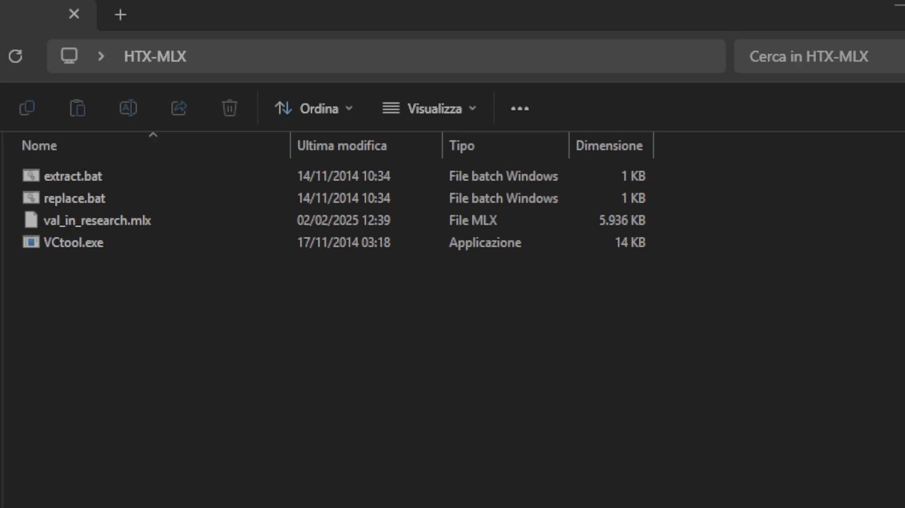
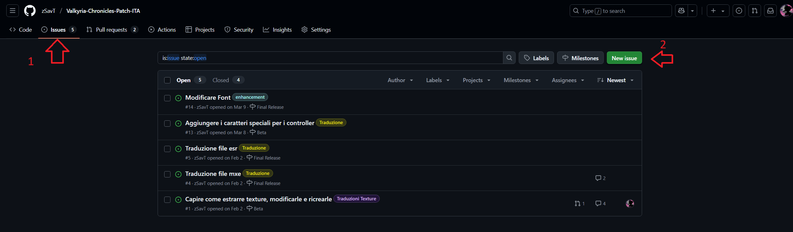
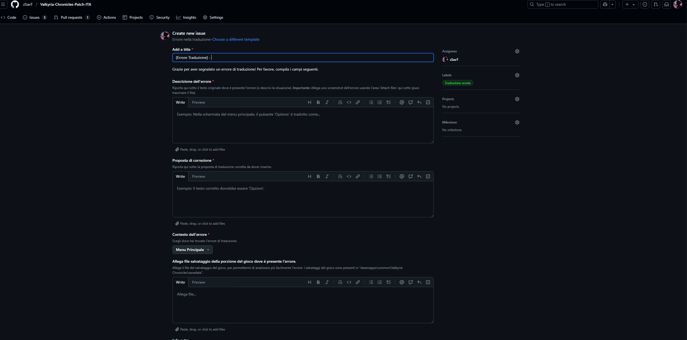
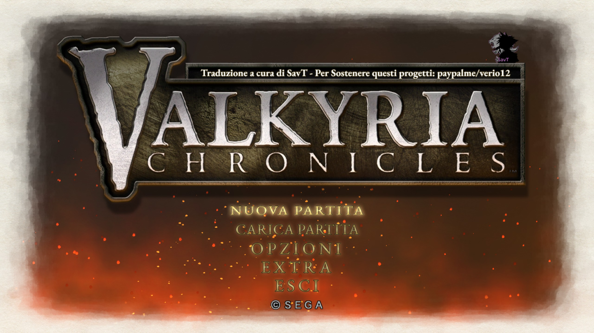
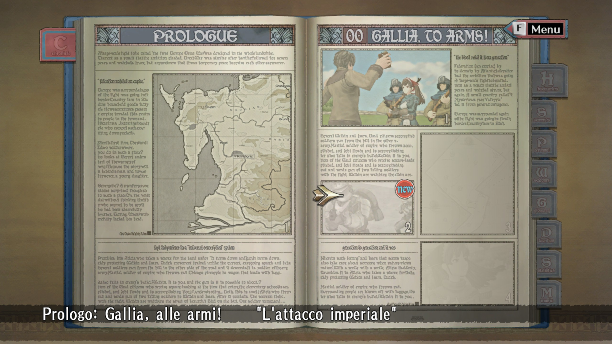
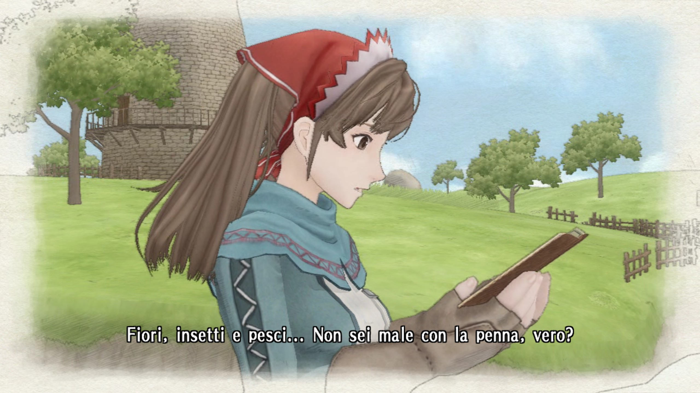

# Valkyria Chronicles Patch ITA 

<p align="center">
  <br>
    Progetto per la traduzione del gioco Valkyria Chronicles in italiano.
</p>


[](https://www.paypal.com/paypalme/verio12)


# INDICE

- [Valkyria Chronicles Patch ITA](#valkyria-chronicles-patch-ita)
- [INDICE](#indice)
  - [STRUTTURA DEI FILE](#struttura-dei-file)
    - [MTP](#mtp)
    - [MXE](#mxe)
      - [COME CONVERTIRE I CSV NEI FILE MXE e MTP](#come-convertire-i-csv-nei-file-mxe-e-mtp)
    - [HTX - MLX - DDS](#htx---mlx---dds)
      - [COME CONVERTIRE I FILE HTX e MLX](#come-convertire-i-file-htx-e-mlx)
- [Funzionamento installer](#funzionamento-installer)
  - [Creazione dell'eseguibile](#creazione-delleseguibile)
    - [Windows](#windows)
    - [Linux (Steam Deck)](#linux-steam-deck)
  - [TO DO](#to-do)
  - [COME SEGNALARE ERRORI NELLA TRADUZIONE/BUG](#come-segnalare-errori-nella-traduzionebug)
  - [VIDEO DIMOSTRATIVO](#video-dimostrativo)
  - [SCREEN PROGETTO](#screen-progetto)
  - [CREDITI](#crediti)


## STRUTTURA DEI FILE

### MTP

Nella cartella "_Valkyria Chronicles\data\resource\mtpa_" sono presenti la maggior parte dei testi delle cinematiche, dei dialoghi in battaglia e del menu\libro. In particolare:

- __mtpa_adv_XX__, contiene i dialoghi presenti nelle cinematiche.
    - Limite massimo di caratteri: 120 (60 per riga)
    - Eccezioni: Ci sono alcuni dialoghi che superano il limite dei 120 caratteri massimi, ma la singola riga non deve comunque superare i 60 caratteri. In questi casi, si segue la struttura del carattere a capo come nella stringa originale in inglese.
    - Carattere a capo: &
- __mtpa_slg_XX__, contiene i dialoghi dei box presenti nelle battaglie.
    - Limite massimo di caratteri: 42/43
    - Eccezione:  I messaggi di dialogo tra i personaggi hanno un lunghezza differente, ovvero 136 caratteri per riga e le righe sono due.
    - Carattere a capo: & (genera anche nuovi box di testo per inserire il testo mancante)
- ~~__mtpa_sys__, contiene testi vari per alcune opzioni del gioco e capitoli.~~
    - ~~Limite massimo di caratteri: ?~~
    - ~~Carattere a capo: &~~
- __mtpa_sys_battle__, contiene testi vari per testi generici delle battaglie.
    - Limite massimo di caratteri: 115 (Di cui la sottostringa massimo 59).
    - Carattere a capo: &
- __mtpa_book__, contiene testi del menu libro dei capitoli.
    - Limite massimo di caratteri: 78
    - Carattere a capo: &
- __mtpa_sys_town__, contiene testi vari, tra cui quelli dei box nel libro.
    - Limite massimo di caratteri: 95 (Con sottostringa 59)
    - Eccezione: I box di dialogo hanno una lunghezza di 576 caratteri di cui ogni sottostringa è lunga max 42 caratteri.
    - Carattere a capo: &
- __mtpa_sys_town2__, contiene testi vari, tra cui quelli dei box nel libro.
    - Limite massimo di caratteri: 114 (Con sottostringa 59/60)
    - Eccezione: I box di dialogo hanno una lunghezza di 371 caratteri di cui ogni sottostringa è lunga max 45 caratteri.
    - Carattere a capo: &
- __mtpa_town__, contiene testi vari, tra cui quelli dei box nel libro.
    - Limite massimo di caratteri: 59
    - Eccezione: I messaggi dei box tutorial come per i slg, i caratteri max sono 42/43.
    - Carattere a capo: &

### MXE

Nella cartella "_Valkyria Chronicles\data\mx_" sono presenti tutti i file mxe che contengono tutto il testo restante (Impostazioni, nomi oggetti ecc...)<br>

#### COME CONVERTIRE I CSV NEI FILE MXE e MTP

Per poter convertire i file CSV nei file MTP, bisogna utilizzare il tool creato da dell'utente "__Feunoir__" postato [qui](https://www.jeuxvideo.com/forums/42-14107-38261510-1-0-1-0-traduction-du-jeu-aide-bienvenue.htm), presente nella repo nella cartella "Patch/Script/outil_csv_vers_mtp". Per convertire i file bisogna inserire nella stessa cartella dove è presente il file exe "_mtp_write.exe_", i file mtp originali e i relativi csv. <br>
Nel file "_mtp_write.ini_" bisogna inserire il nome del file da convertire senza l'estensione (Esempio: convertire il file mtpa_adv_XX.mtp, nel file .ini si inserisce solo "_mtpa_adv_XX_"). Una volta impostato tutto, basta avviare il file exe. In questo modo viene creato un nuovo file "_mpt_" con l'aggiunta di "_new_" in coda al nome. Viene generato anche un file "_test.csv_", che contiene le info sulle lunghezze delle stringhe originali, quelle tradotte e la loro differenza.<p>Questo processo bisogna farlo per ogni file. Se bisogna convertire tanti file, per velocizzare il processo, ho creato uno script python "__mtpConverterAutomatico.py__" (L'autore ha rilasciato anche il codice sorgente del programma, ma son pigro e non mi andava di debbuggare per capire come modificarlo per automatizzarlo per tutti i file). L'unica prerogativa è inserire tutti i file originali e csv nella cartella dell'eseguibile.
Lo stesso identico discorso vale anche per i file MXE (cambia solo la cartella).


N.B. <br>
Si, ho dimenticato di resettare il colore della shell a fine esecuzione, son pigro non credo che sistemerò (è solo estetica e vale solo per la singola istanza della shell).


### HTX - MLX - DDS

I file "_htx_" contengono le texture del gioco, dove sono presenti anche le gui del gioco e alcuni testi (come per esempio il messaggio di ending del gioco). Anche i file "_mlx_" contengono le texture per gli ambienti, personaggi ecc... All'interno dei file HTX e MLX sono presenti i file DSS delle texture.<br>
I file _DDS_ bisogna modificarli seguendo le linee guida indicate in questa [issue](https://github.com/zSavT/Valkyria-Chronicles-Patch-ITA/issues/1).


- Nella cartella "_Valkyria Chronicles\data\texture_replace_" sono presenti texture varie tra cui alcune contenente il testo di alcune interfacce di menu.
    - I file delle immagini sono direttamente nel formato "_dds_".
- Nella cartella "_Valkyria Chronicles\data\resource_" nelle varie sottocartella, sono presenti tutti i file HTX e MLX.

#### COME CONVERTIRE I FILE HTX e MLX
  - Per poter modificare questi due tipologie di file, bisogna utilizzare il [tool](https://steamcommunity.com/sharedfiles/filedetails/?id=343016567) di "__FluffyQuack__". 
  - Per estrarre le texture bisogna trascinare il file della texture sul .bat "_extract.bat_". In questo modo viene creata una cartella con lo stesso nome del file contenente tutte le texture presenti in formato .dds da dover modificare.
  - Per ri-compattare il file, bisogna inserire nella cartella (__Con il nome originale della cartella__), le texture modificate (__Con il nome del file originale della texture__). Bisogna trascinare il file originale sul .bat "_replace.bat_". In questo modo verrà modificato.
  - La cartella contenente le texture, i .bat (con annesso exe) ed il file di originale, devono stare nella stessa cartella madre per poter funzionare correttamente.
  - In alternativa si possono utillizzare i commandi tramite CLI indicati nella guida.



# Funzionamento installer

Per poter creare correttamente l'installer bisogna prima di tutto utilizzare ```packager.py``` per poter generare il file criptato della cartella "_data_". Lo script è guidato e bisogna solo indicare il percorso della cartella con le modifiche della Patch ed il nome del file pkg criptato. Nel file "chiave.txt" bisogna inserire la chiave di criptazione scelta.

## Creazione dell'eseguibile

Per poter generare l'eseguibile dello script bisogna utilizzare la libreria "__pyinstaller__" e generare l'eseguibile con i comandi in base al sistema operativo di arrivo.

### Windows

Per generare l'eseguibile dell'installer per Windows, bisogna utilizzare il seguente comando:
```ps
pyinstaller --onefile --windowed --hidden-import=webbrowser --hidden-import=pyzipper --hidden-import=sys --hidden-import=os --hidden-import=platform --hidden-import=traceback --hidden-import=PyQt6 --icon=assets/logo.png --add-data "assets:assets" --add-data "patch.pkg:." --add-data "chiave.txt:." installer.py
```
Nella cartella "_dist_", è presente l'eseguibile.
### Linux (Steam Deck)

Per generare l'eseguibile per Linux, bisogna fare qualche passaggio in più. L'installer è creato tramite la WSL per Windows.
Per prima cosa bisogna creare l'ambiente virtuale per python tramite il comando:
```ps
python3 -m venv venv
```
Se non fosse presente la funzione nell'ambiente, si può installare tramite il seguente comando:
```ps
sudo apt-get install -y python3-venv
```
Con il comando seguente, attiviamo l'ambiente:
```ps
source venv/bin/activate
```
Dopo aver attivato l'ambiente bisogna installare pyinstaller con il comando:
```ps
pip3 install pyinstaller
```
Se pip non è presente nell'ambiente, bisogna installarlo con il comando:
```ps
sudo apt install -y python3-pip
```
Successivamente bisogna installare tutte le librerie utilizzate, presenti nel file requirements.txt, che in ogni caso sono:

- PyQt6
- pyzipper

Successivamente bisogna avviare il comando per la creazione del file eseguibile:
```ps
pyinstaller --onefile --windowed --hidden-import=webbrowser --hidden-import=pyzipper --hidden-import=sys --hidden-import=os --hidden-import=platform --hidden-import=traceback --hidden-import=PyQt6 --icon=assets/logo.png --add-data "assets:assets" --add-data "patch.pkg:." --add-data "chiave.txt:." installer.py
```

Una volta terminato, si può disattivare l'ambiente con il commando:
```ps
deactivate
```

Nella cartella "_dist_", è presente l'eseguibile (la versione per Linux non ha tipo/estensione).

## TO DO

- [x] Comprendere il funzionamento e logica dietro i file mtp
- [ ] Comprendere il funzionamento e logica dietro i file mxe
- [x] Comprendere il funzionamento e logica dietro i file mlx
- [x] Comprendere il funzionamento e logica dietro i file htx
- [ ] Comprendere il funzionamento e logica dietro i file esr
- [x] Tradurre e adattare tutti i testi mpt
- [ ] Tradurre e adattare tutti i testi mxe
- [ ] Tradurre e adattare tutti i testi esr
- [ ] Rifinire
- [ ] Test completo del gioco

## COME SEGNALARE ERRORI NELLA TRADUZIONE/BUG

Per segnalare errori nella traduzione, bisogna farlo, tramite la sezione "__issue__" della repo come nello screen.


Successivamente bisogna riportare tutte le informazioni richieste per poter correggere l'errore. Allegare un file di salvataggio, semplifica il testing del fix.

## VIDEO DIMOSTRATIVO
[](https://youtu.be/BSpE67GH0fU?si=g56Jf9WjaD7H9fdJ)


## SCREEN PROGETTO






## CREDITI

Si ringrazia per tutto lo sfrozo di analisi dell'utente "__Feunoir__" postato [qui](https://www.jeuxvideo.com/forums/42-14107-38261510-1-0-1-0-traduction-du-jeu-aide-bienvenue.htm), per i csv di partenza per la traduzione e per i software di conversione da csv a mtpa e mxe.<br>
Si ringrazia l'utente Steam "__FluffyQuack__" per il tool di estrazione delle texture per i file htx e mlx [tool](https://steamcommunity.com/sharedfiles/filedetails/?id=343016567).
